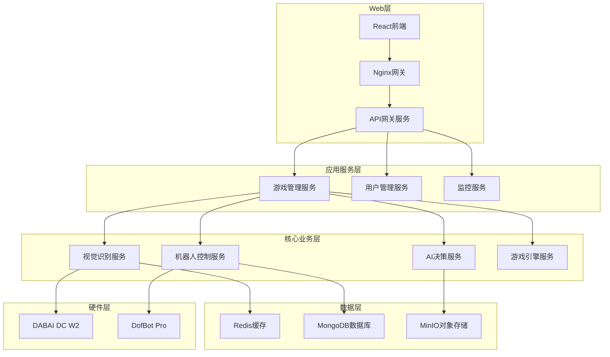

# 智能象棋机器人软件系统实施文档

## 文档信息

- **项目名称**: 智能象棋机器人软件系统
- **文档版本**: v2.0
- **创建日期**: 2025年9月
- **硬件平台**: Jetson Orin Nano Super (4GB) + DofBot Pro + DABAI DC W2
- **目标用户**: 开发团队、运维团队、项目管理者

---

## 目录

1. [项目概述](#1-项目概述)
2. [系统架构设计](#2-系统架构设计)
3. [技术栈选型](#3-技术栈选型)
4. [开发环境搭建](#4-开发环境搭建)
5. [核心模块实施](#5-核心模块实施)
6. [部署方案](#6-部署方案)
7. [测试策略](#7-测试策略)
8. [监控与运维](#8-监控与运维)
9. [安全实施](#9-安全实施)
10. [项目管理](#10-项目管理)

---

## 1. 项目概述

### 1.1 项目目标

构建一个基于深度学习和机器人技术的智能象棋对弈系统，实现：

- **自然人机交互**: 用户在物理棋盘上直接下棋，机器人自动检测并响应
- **高精度视觉感知**: 基于DABAI DC W2深度相机的RGB-D视觉识别
- **精确机械控制**: DofBot Pro机械臂的毫米级精度操作
- **智能AI对弈**: 可调节难度的象棋AI引擎
- **实时Web监控**: 全面的系统状态监控和用户交互界面

### 1.2 技术挑战

#### 硬件限制挑战
- **内存约束**: 4GB内存下的多任务处理优化
- **计算资源**: GPU和CPU资源的智能调度
- **实时性要求**: 视觉处理和机器人控制的时延控制

#### 技术复杂性
- **多模态数据融合**: RGB-D视觉数据的实时处理
- **精确运动控制**: 机械臂的轨迹规划和执行
- **系统集成**: 视觉、控制、AI、Web多系统协调

### 1.3 关键性能指标

```yaml
系统性能目标:
  稳定性:
    - 系统可用性: ≥99.5%
    - 连续运行时间: ≥24小时
    - 故障恢复时间: ≤30秒
  
  性能指标:
    - 移动检测延迟: ≤2秒
    - 机器人响应时间: ≤30秒
    - AI思考时间: 3-10秒(可调)
    - 内存使用率: ≤85%
  
  精度要求:
    - 棋子识别准确率: ≥95%
    - 移动检测准确率: ≥90%
    - 机械臂定位精度: ±1mm
    - 深度检测精度: ±3mm @1m
```

---

## 2. 系统架构设计

### 2.1 总体架构

#### 微服务架构图


### 2.2 数据流设计

#### 事件驱动架构
```python
class EventDrivenArchitecture:
    def __init__(self):
        self.event_types = {
            'board_state_detected': {
                'producer': 'vision_service',
                'consumers': ['game_manager', 'web_gateway']
            },
            'move_detected': {
                'producer': 'vision_service',
                'consumers': ['game_manager', 'ai_engine']
            },
            'ai_move_calculated': {
                'producer': 'ai_engine_service',
                'consumers': ['robot_control', 'game_manager']
            },
            'robot_move_completed': {
                'producer': 'robot_control_service',
                'consumers': ['game_manager', 'vision_service']
            }
        }
```

---

## 3. 技术栈选型

### 3.1 核心技术栈

#### 后端技术选择
```yaml
核心服务技术:
  视觉处理:
    主语言: Python 3.9+
    框架: OpenCV 4.8, TensorRT 8.5
    深度学习: PyTorch 2.0, ONNX Runtime
    并发: AsyncIO, ThreadPoolExecutor
    
  机器人控制:
    主语言: Python 3.9+
    通信: PySerial, AsyncIO
    数值计算: NumPy, SciPy
    运动学: PyBullet (仿真)
    
  AI引擎:
    象棋引擎: Stockfish 15+
    Python库: python-chess 1.999
    并发处理: multiprocessing
    
  Web服务:
    API框架: FastAPI 0.104+
    WebSocket: uvicorn, websockets
    认证: PyJWT, passlib
```

#### 前端技术选择
```yaml
前端技术栈:
  框架: React 18.2+ with TypeScript 5.0+
  状态管理: Zustand 4.4+
  样式: Tailwind CSS 3.3+
  3D渲染: Three.js + React Three Fiber
  图表: Chart.js / D3.js
  实时通信: Socket.io-client
  构建工具: Vite 4.4+
```

---

## 4. 开发环境搭建

### 4.1 Jetson开发环境配置

```bash
#!/bin/bash
# Jetson Orin Nano开发环境安装脚本

echo "=== Jetson Orin Nano开发环境配置 ==="

# 1. 系统更新
sudo apt update && sudo apt upgrade -y

# 2. 安装基础开发工具
sudo apt install -y build-essential cmake git curl wget vim htop tree

# 3. 安装Python开发环境
sudo apt install -y python3.9 python3.9-dev python3-pip python3-venv

# 4. 安装深度学习依赖
wget https://nvidia.box.com/shared/static/p57jwntv436lfrd78inwl7iml6p13fzh.whl -O torch-2.0.0-cp39-cp39-linux_aarch64.whl
pip3 install torch-2.0.0-cp39-cp39-linux_aarch64.whl

# 5. 安装视觉处理库
pip3 install opencv-python==4.8.0.74 numpy==1.24.3 pillow==10.0.0

# 6. 安装机器人控制库
pip3 install pyserial==3.5 scipy==1.10.1 asyncio

# 7. 安装象棋AI库
pip3 install stockfish==3.28.0 python-chess==1.999

# 8. 安装Web框架
pip3 install fastapi==0.104.0 uvicorn==0.23.2 websockets==11.0.3

# 9. 安装数据库驱动
pip3 install motor==3.3.1 aioredis==5.0.0 pymongo==4.5.0

# 10. Docker安装
curl -fsSL https://get.docker.com -o get-docker.sh
sudo sh get-docker.sh
sudo usermod -aG docker $USER

echo "=== 开发环境配置完成 ==="
```

---

## 5. 核心模块实施

### 5.1 视觉识别服务实施

#### 深度相机集成
```python
# services/vision_service/src/vision/camera.py

import asyncio
import cv2
import numpy as np
from typing import Optional, Tuple
import time
import logging
from dataclasses import dataclass

logger = logging.getLogger(__name__)

@dataclass
class RGBDFrame:
    """RGB-D帧数据结构"""
    rgb_frame: np.ndarray
    depth_frame: np.ndarray
    timestamp: float
    frame_id: int

class DABAIDC_W2_Driver:
    """DABAI DC W2深度相机驱动"""
    
    def __init__(self, device_id: int = 0):
        self.device_id = device_id
        self.rgb_cap = None
        self.depth_cap = None
        self.is_initialized = False
        
        # 相机参数
        self.rgb_width = 1920
        self.rgb_height = 1080
        self.depth_width = 640
        self.depth_height = 480
        self.fps = 30
        
        # 深度处理参数
        self.depth_scale = 1000.0  # mm
        self.depth_min = 100       # mm
        self.depth_max = 2000      # mm
        
        # 帧缓冲
        self.frame_buffer = asyncio.Queue(maxsize=2)
        self.capture_task = None
    
    async def initialize(self) -> bool:
        """初始化相机"""
        try:
            # 初始化RGB相机
            self.rgb_cap = cv2.VideoCapture(self.device_id)
            if not self.rgb_cap.isOpened():
                raise RuntimeError(f"Failed to open RGB camera {self.device_id}")
            
            # 设置RGB相机参数
            self.rgb_cap.set(cv2.CAP_PROP_FRAME_WIDTH, self.rgb_width)
            self.rgb_cap.set(cv2.CAP_PROP_FRAME_HEIGHT, self.rgb_height)
            self.rgb_cap.set(cv2.CAP_PROP_FPS, self.fps)
            
            # 初始化深度相机
            self.depth_cap = cv2.VideoCapture(self.device_id + 1)
            if not self.depth_cap.isOpened():
                raise RuntimeError(f"Failed to open depth camera {self.device_id + 1}")
            
            # 设置深度相机参数
            self.depth_cap.set(cv2.CAP_PROP_FRAME_WIDTH, self.depth_width)
            self.depth_cap.set(cv2.CAP_PROP_FRAME_HEIGHT, self.depth_height)
            
            self.is_initialized = True
            
            # 启动采集任务
            self.capture_task = asyncio.create_task(self._capture_loop())
            
            logger.info("DABAI DC W2 camera initialized successfully")
            return True
            
        except Exception as e:
            logger.error(f"Camera initialization failed: {e}")
            return False
    
    async def _capture_loop(self):
        """数据采集循环"""
        frame_id = 0
        
        while self.is_initialized:
            try:
                # 同步采集RGB和深度帧
                rgb_ret, rgb_frame = self.rgb_cap.read()
                depth_ret, depth_frame = self.depth_cap.read()
                
                if rgb_ret and depth_ret:
                    # 处理深度数据
                    processed_depth = self._process_depth_frame(depth_frame)
                    
                    # 创建帧数据
                    rgbd_frame = RGBDFrame(
                        rgb_frame=rgb_frame,
                        depth_frame=processed_depth,
                        timestamp=time.time(),
                        frame_id=frame_id
                    )
                    
                    # 更新缓冲区
                    try:
                        self.frame_buffer.put_nowait(rgbd_frame)
                    except asyncio.QueueFull:
                        # 移除最旧的帧
                        self.frame_buffer.get_nowait()
                        self.frame_buffer.put_nowait(rgbd_frame)
                    
                    frame_id += 1
                
                await asyncio.sleep(1.0 / self.fps)
                
            except Exception as e:
                logger.error(f"Capture error: {e}")
                await asyncio.sleep(0.1)
```

### 5.2 机器人控制服务实施

#### DofBot Pro控制器
```python
# services/robot_control_service/src/robot/controller.py

import asyncio
import serial
import numpy as np
import math
import time
import logging
from typing import List, Tuple, Optional, Dict
from dataclasses import dataclass
from enum import Enum

logger = logging.getLogger(__name__)

@dataclass
class Position3D:
    x: float
    y: float
    z: float

@dataclass
class Position6D:
    x: float
    y: float
    z: float
    rx: float
    ry: float
    rz: float

class DofBotProController:
    """DofBot Pro机械臂控制器"""
    
    def __init__(self, port: str = "/dev/ttyUSB0", baudrate: int = 115200):
        self.port = port
        self.baudrate = baudrate
        self.serial_connection = None
        
        # 机械臂参数
        self.dh_params = [
            [0, 0, 62, 0],
            [0, math.pi/2, 0, math.pi/2],
            [96.33, 0, 0, 0],
            [0, 0, 74.4, 0],
            [0, math.pi/2, 0, 0],
            [0, 0, 0, 0]
        ]
        
        # 关节限制
        self.joint_limits = [
            (-math.pi, math.pi),
            (-math.pi/2, math.pi/2),
            (-2*math.pi/3, 2*math.pi/3),
            (-math.pi, math.pi),
            (-math.pi/2, math.pi/2),
            (-math.pi, math.pi)
        ]
        
        # 当前状态
        self.current_joints = [0.0] * 6
        self.current_pose = Position6D(0, 0, 0, 0, 0, 0)
        
        # 运动参数
        self.default_speed = 50
        self.safe_height = 50  # mm
    
    async def initialize(self) -> bool:
        """初始化机械臂连接"""
        try:
            self.serial_connection = serial.Serial(
                port=self.port,
                baudrate=self.baudrate,
                timeout=2.0,
                write_timeout=2.0
            )
            
            # 测试通信
            response = await self._send_command("STATUS")
            if response:
                await self._home_robot()
                logger.info(f"DofBot Pro connected on {self.port}")
                return True
            else:
                raise Exception("Communication test failed")
                
        except Exception as e:
            logger.error(f"Failed to initialize robot: {e}")
            return False
    
    def forward_kinematics(self, joint_angles: List[float]) -> Position6D:
        """正运动学计算"""
        T = np.eye(4)
        
        for i, (theta, dh) in enumerate(zip(joint_angles, self.dh_params)):
            a, alpha, d, theta_offset = dh
            theta_total = theta + theta_offset
            
            Ti = np.array([
                [math.cos(theta_total), -math.sin(theta_total)*math.cos(alpha),
                 math.sin(theta_total)*math.sin(alpha), a*math.cos(theta_total)],
                [math.sin(theta_total), math.cos(theta_total)*math.cos(alpha),
                 -math.cos(theta_total)*math.sin(alpha), a*math.sin(theta_total)],
                [0, math.sin(alpha), math.cos(alpha), d],
                [0, 0, 0, 1]
            ])
            
            T = T @ Ti
        
        # 提取位置和姿态
        x, y, z = T[:3, 3]
        
        # 提取旋转角度
        ry = math.asin(-T[2, 0])
        rx = math.atan2(T[2, 1], T[2, 2])
        rz = math.atan2(T[1, 0], T[0, 0])
        
        return Position6D(x=x, y=y, z=z, rx=rx, ry=ry, rz=rz)
    
    def square_to_position(self, square: str) -> Position3D:
        """将棋盘坐标转换为机械臂坐标"""
        col = ord(square[0]) - ord('a')  # a-h => 0-7
        row = int(square[1]) - 1         # 1-8 => 0-7
        
        # 棋盘中心为原点，每格40mm
        x = (col - 3.5) * 40.0
        y = (row - 3.5) * 40.0
        z = 10.0  # 棋盘表面高度
        
        return Position3D(x=x, y=y, z=z)
    
    async def execute_pick_and_place(self, from_square: str, to_square: str) -> bool:
        """执行抓取放置操作"""
        try:
            from_pos = self.square_to_position(from_square)
            to_pos = self.square_to_position(to_square)
            
            logger.info(f"Executing pick and place: {from_square} -> {to_square}")
            
            # 1. 移动到起始位置上方
            approach_pose = Position6D(
                x=from_pos.x, y=from_pos.y, z=from_pos.z + self.safe_height,
                rx=math.pi, ry=0, rz=0
            )
            if not await self.move_to_position(approach_pose):
                return False
            
            # 2. 下降到棋子位置
            pick_pose = Position6D(
                x=from_pos.x, y=from_pos.y, z=from_pos.z,
                rx=math.pi, ry=0, rz=0
            )
            if not await self.move_to_position(pick_pose):
                return False
            
            # 3. 抓取棋子
            await self.gripper_close()
            await asyncio.sleep(0.5)
            
            # 4. 提升棋子
            if not await self.move_to_position(approach_pose):
                return False
            
            # 5. 移动到目标位置上方
            target_approach = Position6D(
                x=to_pos.x, y=to_pos.y, z=to_pos.z + self.safe_height,
                rx=math.pi, ry=0, rz=0
            )
            if not await self.move_to_position(target_approach):
                return False
            
            # 6. 下降到放置位置
            place_pose = Position6D(
                x=to_pos.x, y=to_pos.y, z=to_pos.z,
                rx=math.pi, ry=0, rz=0
            )
            if not await self.move_to_position(place_pose):
                return False
            
            # 7. 释放棋子
            await self.gripper_open()
            await asyncio.sleep(0.5)
            
            # 8. 撤离到安全位置
            if not await self.move_to_position(target_approach):
                return False
            
            logger.info(f"Pick and place completed: {from_square} -> {to_square}")
            return True
            
        except Exception as e:
            logger.error(f"Pick and place failed: {e}")
            return False
```

### 5.3 AI引擎服务实施

#### Stockfish引擎封装
```python
# services/ai_engine_service/src/ai/engine.py

import asyncio
import chess
import chess.engine
import time
import logging
from typing import Dict, List, Optional, Any
from dataclasses import dataclass
from enum import Enum

logger = logging.getLogger(__name__)

@dataclass
class MoveResult:
    move: str
    evaluation: float
    depth: int
    nodes: int
    thinking_time: float
    principal_variation: List[str]
    confidence: float

class DifficultyLevel(Enum):
    BEGINNER = 1
    EASY = 2
    NORMAL = 3
    HARD = 4
    EXPERT = 5
    MASTER = 6
    GRANDMASTER = 7
    SUPER_GM = 8
    ENGINE_FULL = 9
    ANALYSIS = 10

class ChessAIEngine:
    """象棋AI引擎"""
    
    def __init__(self, stockfish_path: str = "stockfish", hash_size: int = 128):
        self.stockfish_path = stockfish_path
        self.hash_size = hash_size  # MB
        self.engine = None
        self.board = chess.Board()
        
        # 难度级别配置
        self.difficulty_configs = {
            DifficultyLevel.BEGINNER: {
                'depth': 3, 'time': 1.0, 'skill_level': 0, 'contempt': 0
            },
            DifficultyLevel.EASY: {
                'depth': 4, 'time': 1.5, 'skill_level': 3, 'contempt': 0
            },
            DifficultyLevel.NORMAL: {
                'depth': 6, 'time': 3.0, 'skill_level': 8, 'contempt': 0
            },
            DifficultyLevel.HARD: {
                'depth': 8, 'time': 5.0, 'skill_level': 12, 'contempt': 10
            },
            DifficultyLevel.EXPERT: {
                'depth': 10, 'time': 8.0, 'skill_level': 16, 'contempt': 20
            }
        }
        
        self.current_difficulty = DifficultyLevel.NORMAL
        self.game_history = []
    
    async def initialize(self) -> bool:
        """初始化引擎"""
        try:
            self.engine = chess.engine.SimpleEngine.popen_uci(self.stockfish_path)
            
            # 配置引擎
            await self._configure_engine()
            
            logger.info(f"Stockfish engine initialized with {self.hash_size}MB hash")
            return True
            
        except Exception as e:
            logger.error(f"Failed to initialize Stockfish: {e}")
            return False
    
    async def _configure_engine(self):
        """配置引擎参数"""
        config = self.difficulty_configs[self.current_difficulty]
        
        self.engine.configure({
            'Hash': self.hash_size,
            'Threads': min(2, self.get_available_cores()),
            'Skill Level': config['skill_level'],
            'Contempt': config['contempt'],
            'Ponder': False,
            'MultiPV': 1
        })
    
    def get_available_cores(self) -> int:
        """获取可用CPU核心数"""
        import psutil
        return max(1, min(2, psutil.cpu_count()))
    
    def set_difficulty(self, difficulty: DifficultyLevel):
        """设置难度级别"""
        self.current_difficulty = difficulty
        if self.engine:
            asyncio.create_task(self._configure_engine())
        
        logger.info(f"AI difficulty set to {difficulty.name}")
    
    async def get_best_move(self, time_limit: Optional[float] = None) -> Optional[MoveResult]:
        """获取最佳移动"""
        if not self.engine:
            logger.error("Engine not initialized")
            return None
        
        config = self.difficulty_configs[self.current_difficulty]
        
        if time_limit is None:
            time_limit = config['time']
        
        # 根据内存压力动态调整
        available_memory = self._get_available_memory()
        if available_memory < 1.0:  # 小于1GB时降低复杂度
            time_limit *= 0.7
            depth_limit = min(config['depth'], config['depth'] - 2)
        else:
            depth_limit = config['depth']
        
        start_time = time.time()
        
        try:
            # 设置搜索限制
            limit = chess.engine.Limit(
                time=time_limit,
                depth=depth_limit
            )
            
            # 执行搜索
            result = self.engine.play(self.board, limit)
            thinking_time = time.time() - start_time
            
            if result.move:
                # 获取分析信息
                info = self.engine.analyse(self.board, limit)
                
                # 计算置信度
                confidence = self._calculate_move_confidence(result.move, info)
                
                move_result = MoveResult(
                    move=result.move.uci(),
                    evaluation=self._extract_evaluation(info.get('score')),
                    depth=info.get('depth', 0),
                    nodes=info.get('nodes', 0),
                    thinking_time=thinking_time,
                    principal_variation=[m.uci() for m in info.get('pv', [])[:5]],
                    confidence=confidence
                )
                
                logger.info(f"AI move: {move_result.move}, eval: {move_result.evaluation}, "
                           f"time: {thinking_time:.2f}s")
                
                return move_result
            
        except Exception as e:
            logger.error(f"AI calculation failed: {e}")
        
        return None
    
    def _get_available_memory(self) -> float:
        """获取可用内存（GB）"""
        import psutil
        memory = psutil.virtual_memory()
        return memory.available / (1024**3)
```

---

## 6. 部署方案

### 6.1 容器化部署

#### Docker Compose配置
```yaml
# infrastructure/docker/docker-compose.yml
version: '3.8'

services:
  # Redis - 消息队列和缓存
  redis:
    image: redis:7-alpine
    container_name: robot-chess-redis
    ports:
      - "6379:6379"
    volumes:
      - redis-data:/data
    command: redis-server --maxmemory 400mb --maxmemory-policy allkeys-lru
    restart: unless-stopped
    healthcheck:
      test: ["CMD", "redis-cli", "ping"]
      interval: 30s
      timeout: 10s
      retries: 3
    networks:
      - robot-chess-net

  # MongoDB - 业务数据存储
  mongodb:
    image: mongo:6-jammy
    container_name: robot-chess-mongodb
    ports:
      - "27017:27017"
    environment:
      MONGO_INITDB_ROOT_USERNAME: chess_admin
      MONGO_INITDB_ROOT_PASSWORD: ${MONGO_PASSWORD}
      MONGO_INITDB_DATABASE: robot_chess
    volumes:
      - mongodb-data:/data/db
    command: mongod --wiredTigerCacheSizeGB 0.1 --quiet
    restart: unless-stopped
    networks:
      - robot-chess-net

  # 视觉识别服务
  vision-service:
    build:
      context: ../../services/vision_service
      dockerfile: Dockerfile
    container_name: robot-chess-vision
    depends_on:
      redis:
        condition: service_healthy
    devices:
      - /dev/video0:/dev/video0
      - /dev/video1:/dev/video1
    volumes:
      - /tmp/.X11-unix:/tmp/.X11-unix:rw
      - ./models:/app/models:ro
    environment:
      - DISPLAY=${DISPLAY}
      - REDIS_URL=redis://redis:6379
      - SERVICE_NAME=vision_service
      - LOG_LEVEL=INFO
    deploy:
      resources:
        limits:
          memory: 1.5G
        reservations:
          memory: 1G
    restart: unless-stopped
    networks:
      - robot-chess-net

  # 机器人控制服务
  robot-control-service:
    build:
      context: ../../services/robot_control_service
      dockerfile: Dockerfile
    container_name: robot-chess-robot
    depends_on:
      redis:
        condition: service_healthy
    devices:
      - /dev/ttyUSB0:/dev/ttyUSB0
    environment:
      - REDIS_URL=redis://redis:6379
      - ROBOT_PORT=/dev/ttyUSB0
      - SERVICE_NAME=robot_control_service
    deploy:
      resources:
        limits:
          memory: 512M
    restart: unless-stopped
    networks:
      - robot-chess-net

  # AI引擎服务
  ai-engine-service:
    build:
      context: ../../services/ai_engine_service
      dockerfile: Dockerfile
    container_name: robot-chess-ai
    depends_on:
      redis:
        condition: service_healthy
    environment:
      - REDIS_URL=redis://redis:6379
      - STOCKFISH_PATH=/usr/bin/stockfish
      - SERVICE_NAME=ai_engine_service
    deploy:
      resources:
        limits:
          memory: 1G
    restart: unless-stopped
    networks:
      - robot-chess-net

volumes:
  redis-data:
  mongodb-data:

networks:
  robot-chess-net:
    driver: bridge
```

### 6.2 部署脚本

```bash
#!/bin/bash
# infrastructure/scripts/deploy.sh

set -e

echo "=== 智能象棋机器人系统部署脚本 ==="

# 检查系统要求
check_requirements() {
    echo "检查系统要求..."
    
    # 检查Docker
    if ! command -v docker &> /dev/null; then
        echo "错误: Docker未安装"
        exit 1
    fi
    
    # 检查Docker Compose
    if ! command -v docker-compose &> /dev/null; then
        echo "错误: Docker Compose未安装"
        exit 1
    fi
    
    # 检查可用内存
    AVAILABLE_MEMORY=$(free -g | awk '/^Mem:/{print $7}')
    if [ "$AVAILABLE_MEMORY" -lt 2 ]; then
        echo "警告: 可用内存不足2GB，可能影响系统性能"
    fi
    
    echo "系统要求检查完成"
}

# 准备部署环境
prepare_environment() {
    echo "准备部署环境..."
    
    # 创建必要的目录
    mkdir -p logs models calibration data/images
    
    # 设置权限
    sudo usermod -aG docker $USER
    sudo usermod -aG dialout $USER
    
    # 创建环境变量文件
    if [ ! -f ".env" ]; then
        echo "创建环境变量文件..."
        cat > .env << EOF
MONGO_PASSWORD=$(openssl rand -base64 32)
MINIO_USER=chess_admin
MINIO_PASSWORD=$(openssl rand -base64 32)
JWT_SECRET=$(openssl rand -base64 32)
GRAFANA_PASSWORD=$(openssl rand -base64 16)
DISPLAY=:0
EOF
        echo "环境变量文件已创建: .env"
    fi
    
    echo "环境准备完成"
}

# 构建服务镜像
build_images() {
    echo "构建服务镜像..."
    docker-compose -f infrastructure/docker/docker-compose.yml build --parallel
    echo "镜像构建完成"
}

# 部署系统
deploy_system() {
    echo "部署系统..."
    
    # 启动基础服务
    echo "启动基础服务..."
    docker-compose -f infrastructure/docker/docker-compose.yml up -d redis mongodb
    
    # 等待基础服务就绪
    echo "等待基础服务就绪..."
    sleep 30
    
    # 启动应用服务
    echo "启动应用服务..."
    docker-compose -f infrastructure/docker/docker-compose.yml up -d \
        vision-service robot-control-service ai-engine-service
    
    echo "系统部署完成"
}

# 健康检查
health_check() {
    echo "执行健康检查..."
    
    # 检查服务状态
    docker-compose -f infrastructure/docker/docker-compose.yml ps
    
    echo "健康检查完成"
}

# 主函数
main() {
    case "${1:-deploy}" in
        "deploy")
            check_requirements
            prepare_environment
            build_images
            deploy_system
            sleep 10
            health_check
            ;;
        "stop")
            echo "停止系统..."
            docker-compose -f infrastructure/docker/docker-compose.yml down
            ;;
        "restart")
            echo "重启系统..."
            docker-compose -f infrastructure/docker/docker-compose.yml restart
            ;;
        *)
            echo "用法: $0 {deploy|stop|restart}"
            exit 1
            ;;
    esac
}

main "$@"
```

---

## 7. 测试策略

### 7.1 单元测试

```python
# tests/unit/test_vision_service.py

import pytest
import numpy as np
from unittest.mock import Mock, patch, AsyncMock
from services.vision_service.src.vision.camera import DABAIDC_W2_Driver
from services.vision_service.src.vision.classifier import PieceClassifier, PieceType

class TestDABAICamera:
    """深度相机驱动测试"""
    
    @pytest.fixture
    def camera_driver(self):
        return DABAIDC_W2_Driver(device_id=0)
    
    @patch('cv2.VideoCapture')
    async def test_camera_initialization_success(self, mock_video_capture, camera_driver):
        """测试相机初始化成功"""
        # 模拟相机
        mock_rgb_cap = Mock()
        mock_rgb_cap.isOpened.return_value = True
        mock_depth_cap = Mock()
        mock_depth_cap.isOpened.return_value = True
        
        mock_video_capture.side_effect = [mock_rgb_cap, mock_depth_cap]
        
        # 执行初始化
        result = await camera_driver.initialize()
        
        # 验证结果
        assert result is True
        assert camera_driver.is_initialized is True

class TestPieceClassifier:
    """棋子分类器测试"""
    
    @pytest.fixture
    def classifier(self):
        return PieceClassifier()
    
    def test_height_consistency_check(self, classifier):
        """测试高度一致性检查"""
        # 测试正确的高度
        consistency = classifier._check_height_consistency(
            PieceType.WHITE_PAWN, 20.0
        )
        assert consistency == 1.0
        
        # 测试不正确的高度
        consistency = classifier._check_height_consistency(
            PieceType.WHITE_PAWN, 35.0
        )
        assert consistency < 1.0
```

### 7.2 集成测试

```python
# tests/integration/test_game_flow.py

import pytest
import asyncio
from services.game_manager_service.src.game.manager import GameManager
from services.ai_engine_service.src.ai.engine import ChessAIEngine, DifficultyLevel

class TestGameFlow:
    """游戏流程集成测试"""
    
    @pytest.fixture
    async def game_manager(self):
        manager = GameManager()
        await manager.initialize()
        return manager
    
    async def test_complete_game_flow(self, game_manager):
        """测试完整游戏流程"""
        # 开始新游戏
        game_info = await game_manager.start_new_game(
            human_color="white",
            difficulty=DifficultyLevel.NORMAL
        )
        
        assert game_info['status'] == 'playing'
        assert game_info['human_color'] == 'white'
        
        # 处理人类移动
        human_move_result = await game_manager.process_human_move("e2e4")
        assert human_move_result['success'] is True
        
        # 获取AI移动
        ai_move_result = await game_manager.get_ai_move()
        assert ai_move_result['success'] is True
        assert 'move_result' in ai_move_result
        
        # 清理
        await game_manager.cleanup()
```

---

## 8. 监控与运维

### 8.1 监控配置

```yaml
# infrastructure/monitoring/prometheus.yml
global:
  scrape_interval: 15s
  evaluation_interval: 15s

scrape_configs:
  - job_name: 'robot-chess-services'
    static_configs:
      - targets:
        - 'vision-service:8000'
        - 'robot-control-service:8001'
        - 'ai-engine-service:8002'
        - 'game-manager-service:8003'
```

### 8.2 日志管理

```python
# shared/utils/logger.py

import logging
import structlog
from pathlib import Path

def setup_logging(service_name: str, log_level: str = "INFO"):
    """设置日志系统"""
    
    # 创建日志目录
    log_dir = Path("/var/log/robot-chess")
    log_dir.mkdir(parents=True, exist_ok=True)
    
    # 配置结构化日志
    structlog.configure(
        processors=[
            structlog.stdlib.filter_by_level,
            structlog.stdlib.add_logger_name,
            structlog.stdlib.add_log_level,
            structlog.stdlib.PositionalArgumentsFormatter(),
            structlog.processors.TimeStamper(fmt="iso"),
            structlog.processors.StackInfoRenderer(),
            structlog.processors.format_exc_info,
            structlog.processors.UnicodeDecoder(),
            structlog.processors.JSONRenderer()
        ],
        context_class=dict,
        logger_factory=structlog.stdlib.LoggerFactory(),
        cache_logger_on_first_use=True,
    )
    
    # 配置Python标准日志
    logging.basicConfig(
        format="%(message)s",
        level=getattr(logging, log_level),
        handlers=[
            logging.FileHandler(log_dir / f"{service_name}.log"),
            logging.StreamHandler()
        ]
    )
    
    return structlog.get_logger(service_name)
```

---

## 9. 安全实施

### 9.1 认证授权

```python
# services/web_gateway_service/src/gateway/auth.py

from datetime import datetime, timedelta
from typing import Optional
from jose import JWTError, jwt
from passlib.context import CryptContext
from pydantic import BaseModel

class AuthManager:
    """认证管理器"""
    
    def __init__(self, secret_key: str):
        self.secret_key = secret_key
        self.algorithm = "HS256"
        self.access_token_expire_minutes = 30
        self.pwd_context = CryptContext(schemes=["bcrypt"], deprecated="auto")
    
    def verify_password(self, plain_password: str, hashed_password: str) -> bool:
        """验证密码"""
        return self.pwd_context.verify(plain_password, hashed_password)
    
    def get_password_hash(self, password: str) -> str:
        """生成密码哈希"""
        return self.pwd_context.hash(password)
    
    def create_access_token(self, data: dict) -> str:
        """创建访问令牌"""
        to_encode = data.copy()
        expire = datetime.utcnow() + timedelta(minutes=self.access_token_expire_minutes)
        to_encode.update({"exp": expire})
        encoded_jwt = jwt.encode(to_encode, self.secret_key, algorithm=self.algorithm)
        return encoded_jwt
    
    def verify_token(self, token: str) -> Optional[dict]:
        """验证令牌"""
        try:
            payload = jwt.decode(token, self.secret_key, algorithms=[self.algorithm])
            return payload
        except JWTError:
            return None
```

### 9.2 数据加密

```python
# shared/utils/encryption.py

from cryptography.fernet import Fernet
import base64
import hashlib

class DataEncryption:
    """数据加密工具"""
    
    def __init__(self, key: str):
        # 生成加密密钥
        hashed_key = hashlib.sha256(key.encode()).digest()
        self.cipher_suite = Fernet(base64.urlsafe_b64encode(hashed_key))
    
    def encrypt(self, data: str) -> str:
        """加密数据"""
        encrypted_data = self.cipher_suite.encrypt(data.encode())
        return base64.urlsafe_b64encode(encrypted_data).decode()
    
    def decrypt(self, encrypted_data: str) -> str:
        """解密数据"""
        decoded_data = base64.urlsafe_b64decode(encrypted_data.encode())
        decrypted_data = self.cipher_suite.decrypt(decoded_data)
        return decrypted_data.decode()
```

---

## 10. 项目管理

### 10.1 开发流程

```yaml
开发流程:
  需求分析:
    - 用户故事编写
    - 技术可行性评估
    - 风险评估
  
  设计阶段:
    - 系统架构设计
    - 接口设计
    - 数据库设计
  
  开发阶段:
    - 代码编写
    - 单元测试
    - 代码审查
  
  测试阶段:
    - 集成测试
    - 系统测试
    - 性能测试
  
  部署阶段:
    - 容器化打包
    - 环境配置
    - 健康检查
  
  运维阶段:
    - 监控告警
    - 日志分析
    - 性能优化
```

### 10.2 里程碑计划

```yaml
项目里程碑:
  阶段一（基础架构）:
    时间: 第1-2周
    目标:
      - 完成开发环境搭建
      - 实现基础服务框架
      - 建立CI/CD流程
  
  阶段二（核心功能）:
    时间: 第3-6周
    目标:
      - 完成视觉识别模块
      - 实现机器人控制
      - 集成AI引擎
  
  阶段三（系统集成）:
    时间: 第7-8周
    目标:
      - 服务间通信调试
      - Web界面开发
      - 端到端测试
  
  阶段四（优化部署）:
    时间: 第9-10周
    目标:
      - 性能优化
      - 部署流程完善
      - 文档编写
```

### 10.3 团队协作

```yaml
团队分工:
  技术负责人:
    - 架构设计
    - 技术选型
    - 代码审查
  
  视觉算法工程师:
    - 深度学习模型训练
    - 图像处理算法
    - 相机标定
  
  机器人工程师:
    - 运动控制算法
    - 轨迹规划
    - 安全机制
  
  后端工程师:
    - 服务开发
    - API设计
    - 数据库设计
  
  前端工程师:
    - UI界面开发
    - 3D可视化
    - 用户交互
  
  测试工程师:
    - 测试用例设计
    - 自动化测试
    - 性能测试
  
  运维工程师:
    - 部署方案
    - 监控配置
    - 故障处理
```

---

## 总结

本文档详细描述了智能象棋机器人软件系统的完整实施方案，包括：

1. **系统架构**：采用微服务架构，确保系统的可扩展性和维护性
2. **技术实现**：基于Python生态系统，充分利用成熟的开源框架
3. **硬件集成**：深度相机和机械臂的精确控制与协调
4. **AI引擎**：可调节难度的智能对弈系统
5. **部署方案**：容器化部署，简化运维管理
6. **测试策略**：完善的测试体系，确保系统质量
7. **监控运维**：全面的监控和日志系统
8. **安全机制**：多层次的安全防护措施

通过本方案的实施，可以构建一个稳定、高效、智能的象棋对弈机器人系统，为用户提供优质的人机交互体验。

---

## 附录

### 附录A：硬件规格

```yaml
Jetson Orin Nano Super:
  CPU: 6核ARM Cortex-A78AE
  GPU: 1024核NVIDIA Ampere架构
  内存: 4GB LPDDR5
  存储: 128GB NVMe SSD
  功耗: 15W

DofBot Pro:
  自由度: 6DOF
  重复精度: ±0.2mm
  最大负载: 500g
  工作半径: 320mm
  通信接口: USB串口

DABAI DC W2:
  RGB分辨率: 1920x1080@30fps
  深度分辨率: 640x480@30fps
  深度范围: 0.1-10m
  深度精度: ±3mm@1m
  接口: USB 3.0
```

### 附录B：API文档

```yaml
API端点:
  /api/v1/game:
    POST /start: 开始新游戏
    GET /status: 获取游戏状态
    POST /move: 执行移动
    POST /end: 结束游戏
  
  /api/v1/robot:
    GET /status: 获取机器人状态
    POST /calibrate: 执行标定
    POST /emergency-stop: 紧急停止
  
  /api/v1/vision:
    GET /board: 获取棋盘状态
    POST /detect: 触发检测
    GET /calibration: 获取标定参数
  
  /api/v1/ai:
    POST /analyze: 分析局面
    GET /hint: 获取提示
    POST /difficulty: 设置难度
```

### 附录C：故障排除

```yaml
常见问题:
  相机无法识别:
    - 检查USB连接
    - 验证设备权限
    - 重新标定相机
  
  机械臂通信失败:
    - 检查串口连接
    - 验证波特率设置
    - 重启控制器
  
  AI响应缓慢:
    - 调整难度设置
    - 检查内存使用
    - 优化搜索参数
  
  系统内存不足:
    - 清理日志文件
    - 调整服务内存限制
    - 启用swap分区
```

---

**文档版本**: v2.0  
**最后更新**: 2025年9月  
**维护团队**: 智能机器人实验室