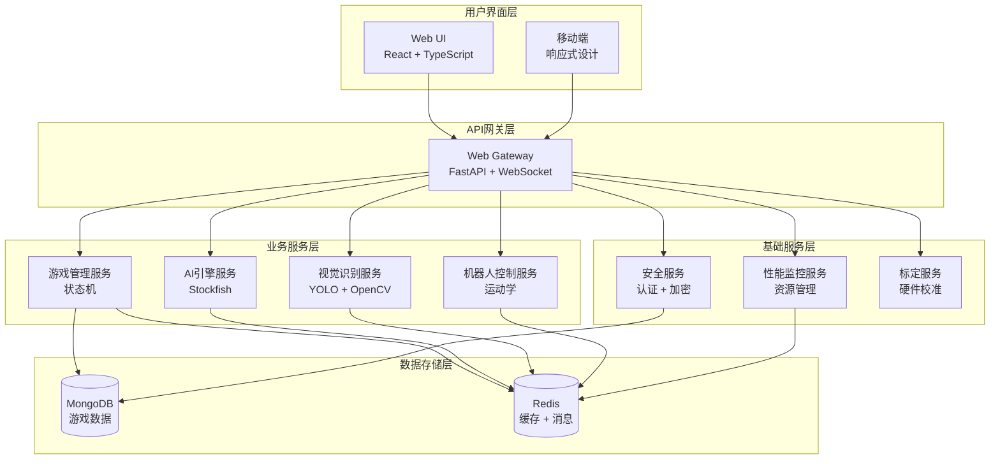

# 智能象棋机器人系统


基于 Jetson Orin Nano 的智能象棋机器人系统，使用深度相机和机械臂实现人机象棋对弈。

## 📋 目录

- [系统概述](#系统概述)
- [核心特性](#核心特性)
- [硬件要求](#硬件要求)
- [系统架构](#系统架构)
- [快速开始](#快速开始)
- [部署指南](#部署指南)
- [使用说明](#使用说明)
- [开发指南](#开发指南)
- [故障排除](#故障排除)
- [API文档](#api文档)
- [贡献指南](#贡献指南)
- [许可证](#许可证)

## 🎯 系统概述

智能象棋机器人是一个集成了计算机视觉、机器人控制、人工智能和Web界面的完整系统。通过深度相机识别棋盘状态，使用Stockfish AI引擎进行决策，并控制机械臂执行棋子移动操作。

### 核心功能

- 🔍 **智能视觉识别**：基于深度学习的棋盘和棋子识别
- 🤖 **精确机械臂控制**：6DOF机械臂精确抓取和放置
- 🧠 **强大AI引擎**：集成Stockfish，支持可调节难度
- 🌐 **现代Web界面**：React + TypeScript 前端界面
- 📊 **实时监控**：系统性能和游戏状态实时监控
- 🔐 **安全防护**：完整的用户认证和数据加密
- ⚡ **性能优化**：针对4GB内存环境优化

## ✨ 核心特性

### 🎨 智能视觉系统
- **DABAI DC W2 深度相机**支持
- **YOLOv8** 棋子识别算法
- **OpenCV** 棋盘检测和坐标映射
- **实时图像处理**，延迟 <2秒

### 🦾 机械臂控制
- **DofBot Pro 6DOF** 机械臂支持
- **正逆运动学**解算
- **轨迹规划**和碰撞避免
- **±1mm** 定位精度

### 🎲 AI引擎
- **Stockfish 16** 国际象棋引擎
- **可调节难度**等级 (1-20)
- **多线程并行**计算
- **开局库**和残局表支持

### 🖥️ 用户界面
- **React 18** + **TypeScript**
- **3D棋盘可视化** (Three.js)
- **响应式设计**
- **实时游戏状态**同步

### 📈 监控和分析
- **Prometheus** 指标收集
- **Grafana** 可视化面板
- **实时性能**监控
- **安全事件**审计

## 🔧 硬件要求

### 主要硬件

| 组件 | 规格 | 用途 |
|------|------|------|
| **主控板** | Jetson Orin Nano Super (4GB) | 系统核心处理器 |
| **机械臂** | DofBot Pro (6DOF) | 棋子抓取和移动 |
| **深度相机** | DABAI DC W2 (RGB-D) | 视觉识别和定位 |

### 系统要求

- **内存**: 4GB RAM
- **存储**: 64GB+ MicroSD (推荐 128GB)
- **网络**: Wi-Fi 或以太网
- **电源**: 15W USB-C 适配器
- **USB**: 3x USB 3.0 接口

### 可选硬件

- **显示器**: HDMI/DP 显示器
- **键盘鼠标**: USB 或蓝牙
- **扬声器**: 语音提示功能

## 🏗️ 系统架构

### 微服务架构图



### 技术栈

#### 后端技术
- **Python 3.9+**: 主要开发语言
- **FastAPI**: Web框架和API服务
- **AsyncIO**: 异步编程支持
- **PyTorch**: 深度学习框架
- **OpenCV**: 计算机视觉处理
- **NumPy/SciPy**: 科学计算

#### 前端技术
- **React 18**: 用户界面框架
- **TypeScript**: 类型安全的JavaScript
- **Three.js**: 3D图形渲染
- **Tailwind CSS**: 样式框架
- **WebSocket**: 实时通信

#### 数据存储
- **MongoDB**: 文档数据库
- **Redis**: 内存缓存和消息队列

#### 部署运维
- **Docker**: 容器化部署
- **Docker Compose**: 多容器编排
- **Prometheus**: 指标监控
- **Grafana**: 可视化仪表板

## 🚀 快速开始

### 先决条件

确保您的Jetson Orin Nano已经安装了：

- Ubuntu 20.04 LTS
- Docker 和 Docker Compose
- Python 3.9+
- 摄像头和串口权限

### 一键部署

1. **克隆项目**
```bash
git clone https://github.com/huahua9185/dofbot_chess.git
cd dofbot_chess
```

2. **环境配置**
```bash
# 复制环境配置文件
cp .env.example .env

# 编辑配置文件
nano .env
```

3. **硬件连接**
```bash
# 连接深度相机到USB 3.0接口
# 连接机械臂到USB串口
# 确保设备权限正确
sudo chmod 666 /dev/video0
sudo chmod 666 /dev/ttyACM0
```

4. **启动系统**
```bash
# 一键部署所有服务
./infrastructure/scripts/deploy.sh deploy

# 等待服务启动完成（约2-3分钟）
docker-compose logs -f
```

5. **访问系统**
```bash
# Web界面
http://localhost:3000

# API文档
http://localhost:8000/docs

# 监控面板
http://localhost:3001
```

### 验证安装

访问 `http://localhost:3000` 应该看到象棋机器人的Web界面。如果页面正常显示，说明系统部署成功。

## 📖 部署指南

详细的部署指南请查看：

- [生产环境部署](docs/deployment/production.md)
- [开发环境搭建](docs/deployment/development.md)
- [Docker配置说明](docs/deployment/docker.md)
- [硬件连接指南](docs/hardware/setup.md)

## 📱 使用说明

### 基本使用流程

1. **系统初始化**
   - 访问Web界面
   - 完成用户注册/登录
   - 检查硬件连接状态

2. **硬件标定**
   - 进入标定页面
   - 完成相机标定
   - 完成机械臂标定

3. **开始游戏**
   - 摆放物理棋盘
   - 选择游戏难度
   - 开始人机对弈

4. **游戏过程**
   - 人类走棋后等待识别
   - 观看机器人执行移动
   - 查看实时游戏状态

### 详细使用说明

- [用户界面指南](docs/user-guide/interface.md)
- [游戏操作说明](docs/user-guide/gameplay.md)
- [硬件标定教程](docs/user-guide/calibration.md)
- [故障排除指南](docs/user-guide/troubleshooting.md)

## 💻 开发指南

### 开发环境搭建

```bash
# 安装Python依赖
pip install -r requirements.txt

# 安装前端依赖
cd web_ui
npm install

# 启动开发服务
npm start
```

### 代码结构

```
dofbot_chess/
├── services/           # 微服务
│   ├── web_gateway/    # Web网关
│   ├── game_manager/   # 游戏管理
│   ├── ai_service/     # AI引擎
│   ├── vision_service/ # 视觉识别
│   └── robot_service/  # 机器人控制
├── shared/            # 共享模块
│   ├── models/        # 数据模型
│   ├── auth/          # 认证授权
│   ├── security/      # 安全模块
│   └── performance/   # 性能优化
├── web_ui/           # React前端
├── tests/            # 测试代码
└── infrastructure/   # 基础设施
```

### 开发文档

- [架构设计文档](docs/development/architecture.md)
- [API接口文档](docs/development/api.md)
- [数据库设计](docs/development/database.md)
- [编码规范](docs/development/coding-standards.md)
- [测试指南](docs/development/testing.md)

## 🔍 故障排除

### 常见问题

#### 1. 摄像头无法识别
```bash
# 检查摄像头连接
ls /dev/video*

# 测试摄像头
python -c "import cv2; print(cv2.VideoCapture(0).read())"
```

#### 2. 机械臂连接失败
```bash
# 检查串口设备
ls /dev/tty*

# 检查权限
sudo chmod 666 /dev/ttyACM0
```

#### 3. 内存不足
```bash
# 查看内存使用
free -h

# 优化内存设置
docker-compose down
docker system prune -a
```

#### 4. 服务启动失败
```bash
# 查看服务状态
docker-compose ps

# 查看服务日志
docker-compose logs [service_name]
```

### 获取帮助

- [常见问题FAQ](docs/support/faq.md)
- [错误代码说明](docs/support/error-codes.md)
- [性能调优指南](docs/support/performance-tuning.md)
- [提交Issue指南](docs/support/issue-reporting.md)

## 📚 API文档

### 核心API端点

| 服务 | 端口 | 文档地址 |
|------|------|----------|
| Web网关 | 8000 | http://localhost:8000/docs |
| 游戏管理 | 8003 | http://localhost:8003/docs |
| AI引擎 | 8004 | http://localhost:8004/docs |
| 视觉识别 | 8005 | http://localhost:8005/docs |
| 机器人控制 | 8006 | http://localhost:8006/docs |
| 安全服务 | 8007 | http://localhost:8007/docs |
| 性能监控 | 8008 | http://localhost:8008/docs |

### WebSocket事件

详细的WebSocket事件文档请查看 [WebSocket API文档](docs/api/websocket.md)。

## 🤝 贡献指南

我们欢迎所有形式的贡献！

### 参与方式

1. **代码贡献**
   - Fork 项目
   - 创建功能分支
   - 提交代码
   - 创建 Pull Request

2. **问题报告**
   - 使用 Issue 模板
   - 提供详细信息
   - 包含复现步骤

3. **文档改进**
   - 修正错误
   - 补充说明
   - 添加示例

### 开发流程

详细的贡献指南请查看 [CONTRIBUTING.md](CONTRIBUTING.md)。

## 📄 许可证

本项目采用 MIT 许可证。详情请查看 [LICENSE](LICENSE) 文件。

## 🙏 致谢

感谢以下开源项目的支持：

- [Stockfish](https://stockfishchess.org/) - 强大的象棋引擎
- [OpenCV](https://opencv.org/) - 计算机视觉库
- [PyTorch](https://pytorch.org/) - 深度学习框架
- [FastAPI](https://fastapi.tiangolo.com/) - 现代Web框架
- [React](https://reactjs.org/) - 用户界面库

## 📞 联系我们

- **项目主页**: https://github.com/huahua9185/dofbot_chess
- **问题反馈**: https://github.com/huahua9185/dofbot_chess/issues
- **文档站点**: https://dofbot-chess.readthedocs.io/

---

🔗 **相关链接**
- [技术博客](docs/blog/)
- [视频演示](docs/videos/)
- [更新日志](CHANGELOG.md)
- [路线图](ROADMAP.md)

---

<p align="center">
  <strong>智能象棋机器人 - 让AI与传统文化完美结合</strong>
</p>